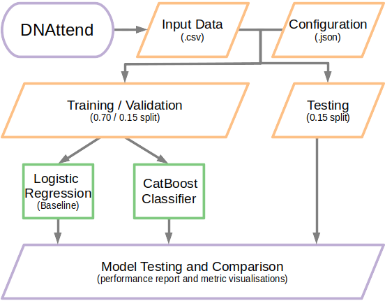

# DNAttend - ML framework for predicting patient non-attendance

## Train, test and validate a CatBoost Classifier for predicting patient non-attendance (DNA)

[](https://github.com/GIScience/badges#experimental)


## Table of contents

  * [Installation](#installation)
    * [Virtual Environment](#virtual-environment)
      * [Unix/macOS](#unixmacos)
      * [Windows](#windows)
    * [Docker](#docker)
  * [Workflow](#workflow)
  * [Usage](#usage)
    * [Generate Example Data](#generate-example-data)
    * [Train Model](#train-model)
    * [Evaluate Model](#evaluate-model)
    * [Refit Model with All Data](#refit-model-with-all-data)
    * [Generate Predictions](#generate-predictions)
  * [Example Data Verification](#example-data-verification)
  * [Configuration](#configuration)
  * [Further Documentation](#additional-documentation)
  * [Contributing](#contributing)
  * [License](#license)
  * [Contact](#contact)

## Installation
Installation is possible via `pip` as shown below.
To manage dependencies and avoid conflicts it is recommended to install within a [virtual environment](#virtual-environment) or a [Docker container](#docker) as described.

```bash
pip install git+https://github.com/nhsx/dna-risk-predict.git
```

### Virtual Environment

#### Unix/macOS
Run the following commands via Terminal.

```bash
python -m venv dnattend
source dnattend/bin/activate
pip install git+https://github.com/nhsx/dna-risk-predict.git
```

#### Windows
Run the following commands via PowerShell.

```PowerShell
py -m venv dnattend
dnattend/Scripts/Activate.ps1
pip install git+https://github.com/nhsx/dna-risk-predict.git
```

If running scripts is disabled on your system then run the following command before activating your environment.

```PowerShell
Set-ExecutionPolicy -ExecutionPolicy RemoteSigned -Scope CurrentUser
```

### Docker

```bash
git clone --depth 1 https://github.com/nhsx/dna-risk-predict.git
docker build -t dnattend .
docker run dnattend --help
```

To run the following example via Docker we recommended using docker volumes to access local data from the docker container.
The following command mounts the current directory to the directory `/out` within the container.
Following this we update the container working directory (`-w /out`) and run the commands as normal.

```bash
docker run -v $(pwd):/out -w /out \
  dnattend process config.yaml
```

## Worklow


 <br> *Overview of DNAttend workflow*

Refer to the [additional documentation](./README_files/docs.md) for further details of the underlying classifier framework.

## Usage
The following sections document the built-in example workflow provided.
It is recommended that users follow this workflow to verify proper installation.

### Generate Example Data
The ```simulate``` sub-command generates suitably formatted input data for testing functionality.
It also writes an example config file in YAML format.
Both of these output files can serve as templates for building real-world models.

```bash
dnattend simulate --config config.yaml > DNAttend-example.csv
```

### Train Model
DNAttend trains two models independently; a baseline logistic regression model and a CatBoost model.
The baseline model is simple model that acts as reference to assess performance improvements of CatBoost.
Refer to the [additional documentation](./README_files/docs.md) for further details of the model workflow.

```bash
dnattend train config.yaml
```

### Evaluate Model
Following initial training, the `dnattend test` command can be used to assess performance of both the logistic regression and CatBoost models against the hold-out testing data set.
Refer to the [additional documentation](./README_files/docs.md) for example output visualisation and performance metrics.

```bash
dnattend test config.yaml
```

### Refit Model with All Data
The previous steps have trained two models: a baseline logistic regression model and a more advanced CatBoost.
Following parameterisation and assessment of model performance, a final model can be retrained using the entire data set.
The user may build a logistic regression or CatBoost model depending on the performance metrics.
This choice must be specified by the user in the `finalModel:` option of the configuration file.

```bash
dnattend retrain config.yaml
```

### Generate Predictions
The trained model is now ready to be used.
Predictions should be made with the `predict` module - this ensures the tuned decision threshold is correctly applied when assigning classes.
The output of `predict` includes the decision class (i.e.`Attend` and `DNA`) and the underlying probabilities of theses classes.
The output results of this example can be found [here](./README_files/example-data-predictions.csv)

```bash
dnattend predict --verify DNAttend-example.csv catboost-final.pkl > FinalPredictions.csv
```

**Note: the `--verify` flag is only required when running the example workflow ([see below](#example-data-verifcation)).**

## Example Workflow Verification
Following initial installation, it is recommended that users run the example workflow, as described, to verify that the pipeline is functioning as expected.
The `--verify` flag of `dnattend predict`, as shown above, will check the results against the expected output and notify the user if the output matches or not.

## Configuration
DNAttend utilises a single configuration file, in YAML, which documents all model parameter and ensure reproducibility of the analysis.
The `dnattend simulate` command writes an example documented configuration file that the user can use as a template.
A copy of this file is shown below and available to download [here](./README_files/config.yaml).

```YAML
input: DNAttend-example.csv    # Path to input data (Mandatory).
target: status                 # Column name of target (Mandatory).
DNAclass: 1                    # Value of target corresponding to DNA.
out: .                         # Output directory to save results.
finalModel: catboost           # Method to train final model (catboost or logistic).
catCols:                       # Column names of categorical features.
    - day
    - priority
    - speciality
    - consultationMedia
    - site
boolCols:                      # Column names of boolean features.
    - firstAppointment
numericCols:                   # Column names of numeric features.
    - age
train_size: 0.7                # Proportion of data for training.
test_size: 0.15                # Proportion of data for testing.
val_size: 0.15                 # Proportion of data for validation.
tuneThresholdBy: f1            # Metric to tune decision threshold (f1 or roc).
cvFolds: 5                     # Hyper-tuning cross-validations.
catboostIterations: 100        # Hyper-tuning CatBoost iterations.
hypertuneIterations: 5         # Hyper-tuning parameter samples.
evalIterations: 10_000         # Upper-limit over-fit iterations.
earlyStoppingRounds: 10        # Over-fit detection early stopping rounds.
seed: 42                       # Seed to ensure workflow reproducibility.
```

## Further Documentation
Refer to the [additional documentation](./README_files/docs.md) for further technical details of the modeling framework and visualisations from the example data set.

### Contributing

Contributions are what make the open source community such an amazing place to learn, inspire, and create. Any contributions you make are **greatly appreciated**.

1. Fork the Project
2. Create your Feature Branch (`git checkout -b feature/AmazingFeature`)
3. Commit your Changes (`git commit -m 'Add some AmazingFeature'`)
4. Push to the Branch (`git push origin feature/AmazingFeature`)
5. Open a Pull Request

### License

Distributed under the MIT License. _See [LICENSE](./LICENSE) for more information._

### Contact

If you have any other questions please contact the author **[Stephen Richer](https://www.linkedin.com/in/stephenricher/)**
at stephen.richer@proton.me
