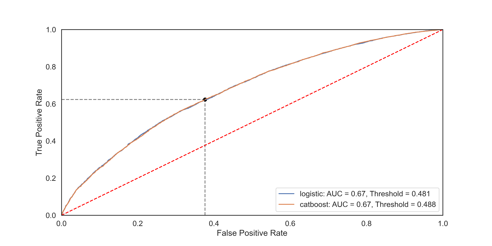
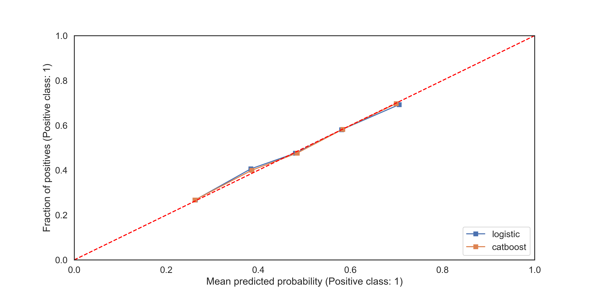

# DNAttend - ML framework for predicting patient non-attendance

## Additional documentation and example visualisations

[](https://github.com/GIScience/badges#experimental)


## Table of contents

  * [Workflow](#workflow)
  * [Evaluate Model](#evaluate-model)
      * [Feature Importance](#feature-importance)
      * [ROC Curve](#roc-curve)
      * [Precision-Recall Curve](#precision-recall-curve)
      * [Calibration Curve](#calibration-curve)
      * [Evaluation Report](#evaluation-report)
    * [Refit Model with All Data](#refit-model-with-all-data)
  * [Generate Predictions](#generate-predictions)
  * [Contributing](#contributing)
  * [License](#license)
  * [Contact](#contact)


## Worklow


 <br> *Overview of DNAttend workflow*

### Evaluate Model

#### Feature Importance

```python
featureImportances = test.getFeatureImportance(models['catboost']['model'])
fig = featureImportances.plot.barh()
fig.figure.savefig('featureImportances.png')
```


 <br> *Feature Importances.*

#### ROC Curve

```python
fig, ax = test.plotROC(models, data)
fig.figure.savefig('ROCcurve.png')
```


 <br> *Receiver Operating Characteristic curve for both CatBoost and Logistic Model.*

#### Precision-Recall Curve

```python
fig, ax = test.plotPrecisionRecall(models, data)
fig.figure.savefig('PRcurve.png', dpi=300)
```


 <br> *Precision-Recall curve for both CatBoost and Logistic Model.*

#### Calibration Curve

```python
fig, ax = test.plotCalibrationCurve(models, data, strategy='quantile')
fig.figure.savefig('CalibrationCurve.png')
```


 <br> *Calibration curve for both CatBoost and Logistic Model.*

#### Evaluation Report
The `evaluate()` function computes a comprehensive set of performance metrics using the `test` data.

```python
report = test.evaluate(models['catboost']['model'], data)

print(report)
{
    'Attend': {
        'precision': 0.7976354138025845,
        'recall':    0.7815193965517241,
        'f1-score':  0.7894951694108042,
        'support':   3712
    },
    'DNA': {
        'precision': 0.7901138716356108,
        'recall':    0.8057534969648984,
        'f1-score':  0.7978570495230629,
        'support':   3789
    },
    'accuracy':      0.7937608318890814,
    'macro avg': {
        'precision': 0.7938746427190977,
        'recall':    0.7936364467583112,
        'f1-score':  0.7936761094669336,
        'support':   7501
    },
    'weighted avg': {
        'precision': 0.7938360372833652,
        'recall':    0.7937608318890814,
        'f1-score':  0.7937190280623637,
        'support':   7501
    }
}

```
